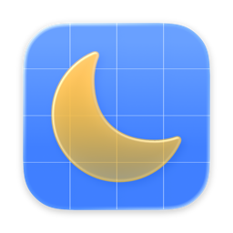
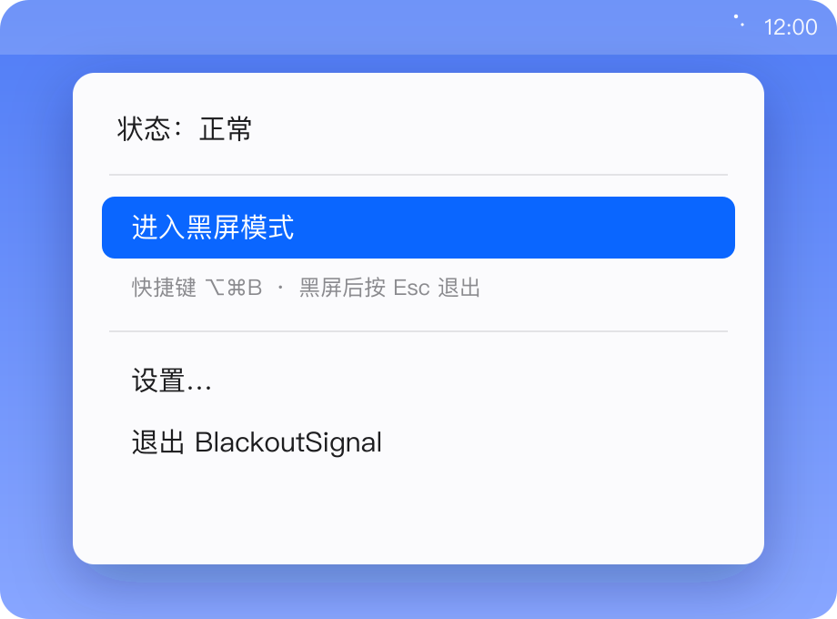
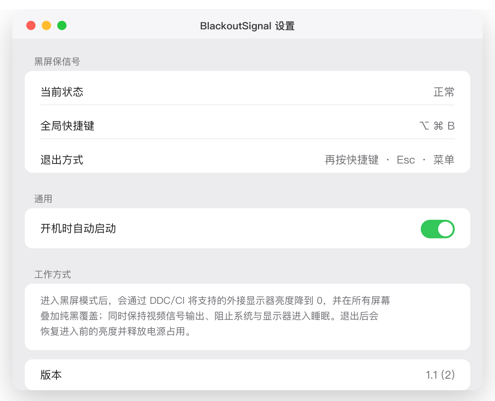

<p align="center">
  
</p>

<h1 align="center">BlackoutSignal</h1>

<p align="center">
  一键「黑屏但保持视频信号」的 macOS 菜单栏小工具<br>
  A one-key “blackout while keeping the video signal alive” menu-bar app for macOS
</p>

<p align="center">
  <a href="https://github.com/is52hertz/BlackoutSignal/releases/latest"></a>
  <a href="https://github.com/is52hertz/BlackoutSignal/releases"></a>
  
  
  
</p>

<p align="center">
  <a href="https://github.com/is52hertz/BlackoutSignal/releases/latest"><b>⬇️ 下载最新 .dmg / Download the latest .dmg</b></a>
</p>

---

Mac mini 外接显示器时，Mac 休眠后显示器会跳出烦人的「无输入 / 蓝屏」。BlackoutSignal 让屏幕变黑但**不切断视频信号**，从而避免这个尴尬。它**不是锁屏**，也不会真的让 Mac 睡眠。

When a Mac sleeps, an external monitor often shows an annoying “No Input” / blue screen. BlackoutSignal blacks the screen out **without** dropping the video signal, so that never happens. It is **not** a lock screen and never truly sleeps the Mac.

## 截图 / Screenshots

> 以下为示意图（按真实界面文案绘制）。/ Illustrative mockups drawn from the actual UI strings.

<p align="center">
  
  &nbsp;&nbsp;
  
</p>

## 功能 / Features

进入黑屏模式时会**同时**：

- 通过 **DDC/CI** 把支持的外接显示器亮度降到 **0**（退出时恢复**进入前的原值**，绝不用固定默认值）。
- 在**所有**屏幕叠加置顶**纯黑覆盖**（不支持 DDC/CI 的显示器的可靠兜底）。
- 持有 IOKit 电源断言，阻止**显示器与 Mac 因闲置而睡眠**，保持信号；退出立即释放。
- 多显示器支持，显示器热插拔不崩溃；崩溃/异常退出后下次启动可**恢复亮度**。

When you trigger blackout, it simultaneously dims every DDC/CI display to **brightness 0** (restoring the exact previous value on exit), covers **all** screens with a pure-black top-level overlay, and holds IOKit power assertions so the display and Mac don’t idle-sleep — released the moment you exit. Multi-display aware, hot-plug safe, with brightness recovery after a crash.

## 运行要求 / Requirements

- Apple Silicon Mac, **macOS 26+**.

## 安装 / Install

1. 从 [Releases](https://github.com/is52hertz/BlackoutSignal/releases/latest) 下载 `BlackoutSignal-x.y.dmg` 并打开。
2. 把 **BlackoutSignal** 拖到 **Applications（应用程序）**。
3. **首次打开（重要）**：此版本用个人 Apple Development 证书签名、**未做公证**，Gatekeeper 会拦截。请**右键点按** App → **打开** → **打开**。若仍被拒绝，在「终端」执行一次：
   ```sh
   xattr -dr com.apple.quarantine /Applications/BlackoutSignal.app
   ```

> This build is signed with a personal Apple Development certificate and is **not notarized**. On first launch, right-click the app → **Open**, or run the `xattr` command above once.

## 使用 / Usage

- 应用常驻**菜单栏**（月亮图标），无 Dock 图标、无窗口。
- 全局快捷键 **⌥ ⌘ B** 进入/退出黑屏。
- 随时退出：再按一次快捷键、按 **Esc**、或点菜单栏项。
- 「**设置**」窗口含状态、快捷键和**开机时自动启动**开关。

It lives in the **menu bar**. Toggle with **⌥⌘B**; exit with the hotkey again, **Esc**, or the menu. The **Settings** window has status and a **Launch at login** toggle.

## 工作原理 / How it works

| 层 / Layer | 说明 / What |
| --- | --- |
| `BSDisplayDDC` (Obj-C) | Apple Silicon DDC/CI via the private `IOAVService`; only ever touches VCP `0x10` (luminance) — never power/standby, which would drop the signal. |
| `OverlayManager` | 每屏一个置顶无边框纯黑窗口 / borderless black window per screen, captures **Esc**, hides the cursor. |
| `PowerAssertionManager` | IOKit `PreventUserIdleDisplaySleep` + `PreventUserIdleSystemSleep`, only while blacked out. |
| `HotKeyManager` | Carbon `RegisterEventHotKey` — **no** Accessibility/Input-Monitoring permission. |
| `BrightnessStore` | 崩溃恢复用的会话持久化 / persists the session for crash recovery. |

> ⚠️ **DDC 调暗需要走 DisplayPort（USB‑C / 雷雳口）。** Mac mini 的**内置 HDMI** 口上 `IOAVService` 可能无法 DDC——屏幕仍会被覆盖层全黑，但背光不会降到 0。
> **DDC dimming needs DisplayPort (USB-C / Thunderbolt).** On a Mac mini’s built-in HDMI port, `IOAVService` may not work — the overlay still makes it fully black, but the backlight won’t drop to 0.

## 从源码构建 / Build from source

```sh
git clone https://github.com/is52hertz/BlackoutSignal.git
cd BlackoutSignal/BlackoutSignal
open BlackoutSignal.xcodeproj      # 用 Xcode 26 打开后 ⌘R
# 或命令行 / or CLI:
xcodebuild -scheme BlackoutSignal -configuration Release -destination 'generic/platform=macOS' build
```

需要 Xcode 26。注意：因为 Apple Silicon 上的 DDC/CI 需要 IOKit 访问，**App 沙盒被有意关闭**。/ Requires Xcode 26. The **App Sandbox is intentionally off** because DDC/CI on Apple Silicon needs IOKit access.

## 隐私 / Privacy

无网络、无数据收集、无遥测。不要求不必要的隐私权限。/ No network, no data collection, no telemetry, no unnecessary privacy permissions.

## 致谢 / Credits

DDC/CI 实现参考了优秀的 [waydabber/m1ddc](https://github.com/waydabber/m1ddc)。/ The DDC/CI approach is informed by the excellent [m1ddc](https://github.com/waydabber/m1ddc).
